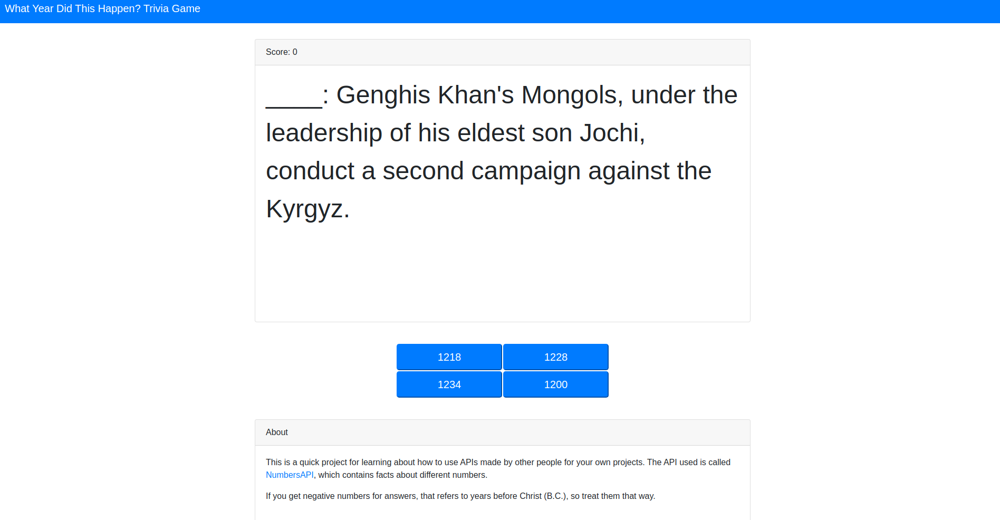

# What Year Did This Happen? Trivia Game
This is a simple trivia game that tests one's knowledge of history. Given an event, the player must correctly guess what year it happened.

This is a quick project for learning about how to use APIs made by other people for your own projects. The API used is called [NumbersAPI](http://numbersapi.com/), which contains facts about different numbers.

You can try it for yourself here: [Link](https://ryans-projects-for-personal-learning.github.io/What-Year-Did-This-Happen-Trivia-Game/)

